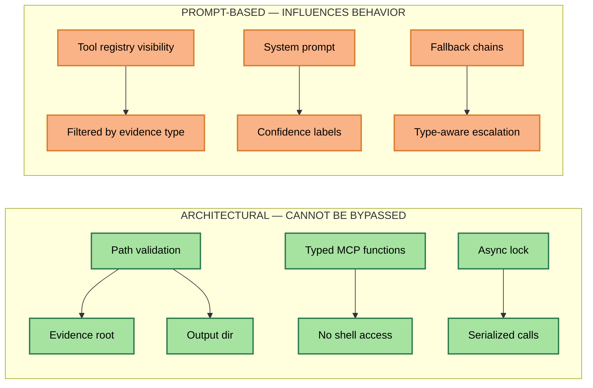
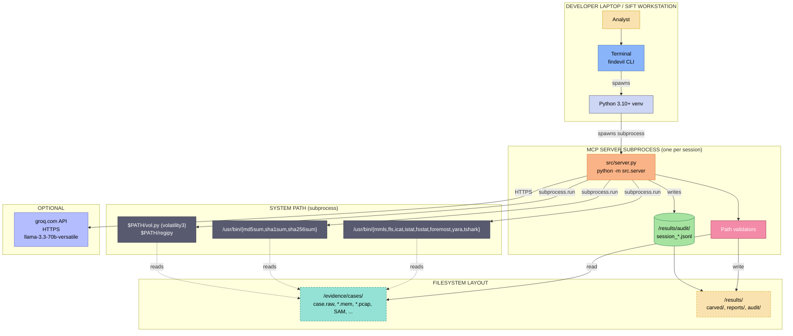

# FindEvil Agent — Technical Architecture

> **Autonomous DFIR Analysis Agent** — 23 typed forensic tools, Groq AI orchestration,
> evidence-root enforcement, full audit trail, zero-trust design.

---

## 1. TL;DR

FindEvil is a **three-tier DFIR orchestrator** that lets an analyst investigate
disk images, memory dumps, PCAPs, and registry hives in plain English:

```
Analyst ──▶ Rich CLI ──▶ ReAct Agent ──▶ MCP Server ──▶ Typed Forensic Tools ──▶ SIFT binaries
  "investigate /evidence/cases/case.raw"                                       (mmls, fls, yara, …)
```

**What makes it different**: The AI is *physically constrained*. It cannot
type arbitrary shell commands. Every system call is a typed function with
validated arguments. The LLM only ever **suggests** which of 23 pre-vetted
tools to call next; the MCP server enforces what actually runs.

---

## 2. System Data Flow

```mermaid
flowchart TB
    %% ── Analyst zone (untrusted input) ──────────────────────────
    subgraph Analyst_Workstation["ANALYST WORKSTATION (untrusted)"]
        direction TB
        A[Analyst<br/>natural language]:::user
        CLI[Rich CLI<br/>src/cli.py<br/>~1040 LoC]:::cli
    end

    %% ── LLM zone (semi-trusted: hallucinates) ───────────────────
    subgraph Agent_Process["AGENT PROCESS (Python asyncio)"]
        direction TB
        REACT[DFIRWorkflow<br/>ReAct loop<br/>src/agent/loop.py<br/>~950 LoC]:::agent
        GROQ[GroqDFIRClient<br/>Llama 3.3 70B<br/>src/agent/groq_client.py<br/>~470 LoC]:::llm
        SEL[ToolSelector<br/>58-entry registry<br/>src/agent/tool_selector.py]:::selector
    end

    %% ── MCP trust boundary ──────────────────────────────────────
    subgraph MCP_Server["MCP SERVER (trust boundary — stdio)"]
        direction TB
        SERVER[FastMCP Server<br/>23 typed tools<br/>src/server.py<br/>~2400 LoC]:::mcp
        VAL[/"_validate_evidence_path()<br/>_validate_output_dir()<br/>ARCHITECTURAL GUARDRAILS"/]:::guard
        LOCK["asyncio.Lock<br/>per-call serialization"]:::lock
        AUDIT[(Audit Log<br/>session_*.jsonl)]:::audit
        SEC[(Security Events<br/>security_events.jsonl)]:::sec
    end

    %% ── Tool execution zone (system calls) ──────────────────────
    subgraph Tool_Layer["TOOL EXECUTION LAYER"]
        direction LR
        T1[filesystem.py<br/>TSK]:::tool
        T2[carving.py<br/>foremost]:::tool
        T3[memory.py<br/>volatility3]:::tool
        T4[network.py<br/>tshark]:::tool
        T5[patterns.py<br/>yara]:::tool
        T6[registry.py<br/>regipy]:::tool
        T7[hashing.py<br/>coreutils]:::tool
        RES[tool_resolver.py<br/>cross-platform<br/>shutil.which + TOOL_LOCATIONS]:::resolver
    end

    %% ── Filesystem trust boundaries ─────────────────────────────
    subgraph Evidence_FS["EVIDENCE ROOT (read-only, validated)"]
        EVD["/evidence/cases/*.raw<br/>disk images, .mem, .pcap, hives"]:::evidence
    end

    subgraph Results_FS["RESULTS ROOT (write-only, validated)"]
        RES_OUT["/results/<br/>carved/, audit/, reports/"]:::results
    end

    subgraph System_Bins["SYSTEM BINARIES (subprocess)"]
        S1[sleuthkit<br/>mmls, fls, icat, istat, fsstat]:::sys
        S2[foremost<br/>bulk_extractor]:::sys
        S3[volatility3]:::sys
        S4[tshark]:::sys
        S5[yara]:::sys
        S6[regipy]:::sys
        S7[coreutils<br/>sha256sum]:::sys
    end

    %% ── Main flow arrows ────────────────────────────────────────
    A -- "investigate /evidence/cases/case.raw" --> CLI
    CLI -- "spawn subprocess" --> REACT
    REACT -- "1. ask next tool" --> GROQ
    GROQ -. "JSON tool list" .-> REACT
    REACT -. "fallback if LLM down" .-> SEL
    REACT -- "2. tools/call {name, args}" --> SERVER
    SERVER --> VAL
    VAL -- "OK / reject" --> LOCK
    LOCK -- "log to" --> AUDIT
    LOCK -- "violations →" --> SEC
    LOCK -- "3. dispatch by name" --> T1 & T2 & T3 & T4 & T5 & T6 & T7
    T1 & T2 & T3 & T4 & T5 & T6 & T7 -- "4. resolve binary" --> RES
    RES -- "5. subprocess.run" --> S1 & S2 & S3 & S4 & S5 & S6 & S7
    S1 & S2 & S3 & S4 & S5 & S6 & S7 -- "stdout" --> T1 & T2 & T3 & T4 & T5 & T6 & T7
    S1 & S2 & S3 & S4 & S5 & S6 & S7 -. "read-only" .-> EVD
    S2 -- "write to" --> RES_OUT
    T1 & T2 & T3 & T4 & T5 & T6 & T7 -- "6. JSON result" --> SERVER
    SERVER -- "7. TextContent" --> REACT
    REACT -- "8. extract findings<br/>(confidence scored)" --> CLI
    GROQ -. "9. final report<br/>(or narrative fallback)" .-> CLI

    %% ── Trust boundary marker (dashed) ──────────────────────────
    linkStyle 3,4,5,6,7,8,9,10,11,12,13,14,15,16,17,18,19,20,21,22,23,24,25,26,27 stroke:#1f6feb,stroke-width:1.5px

    classDef user fill:#f9e2af,stroke:#d4a017,color:#000
    classDef cli fill:#89b4fa,stroke:#3b6cb0,color:#000
    classDef agent fill:#94e2d5,stroke:#1a8a7a,color:#000
    classDef llm fill:#f5c2e7,stroke:#a866b0,color:#000
    classDef selector fill:#cdd6f4,stroke:#585b70,color:#000
    classDef mcp fill:#fab387,stroke:#d97c2c,color:#000
    classDef guard fill:#f38ba8,stroke:#a02f4a,color:#fff,stroke-width:3px
    classDef lock fill:#45475a,stroke:#313244,color:#fff
    classDef audit fill:#a6e3a1,stroke:#2c7a4a,color:#000
    classDef sec fill:#eba0ac,stroke:#88334a,color:#000
    classDef tool fill:#74c7ec,stroke:#2c84aa,color:#000
    classDef resolver fill:#b4befe,stroke:#5b5fcc,color:#000
    classDef evidence fill:#94e2d5,stroke:#1a8a7a,color:#000,stroke-dasharray:5 3
    classDef results fill:#f9e2af,stroke:#d4a017,color:#000,stroke-dasharray:5 3
    classDef sys fill:#585b70,stroke:#313244,color:#fff
```



### ASCII fallback (for non-Mermaid renderers)

```
ANALYST (untrusted)         AGENT PROCESS              MCP SERVER (trust boundary)         SYSTEM
─────────────────────       ─────────────              ──────────────────────────          ──────
                                                    ┌─ _validate_evidence_path() ─┐
Analyst ──▶ Rich CLI  ──▶  DFIRWorkflow  ──tools/─▶  │  rejects ../etc/passwd       │ ──▶ sleuthkit
"investigate              │  ReAct loop  ◀─result─│  rejects null bytes           │ ──▶ foremost
 /evidence/               │                       │  rejects paths > 4096 chars   │ ──▶ yara
 cases/case.raw"          │                       │  enforces EVIDENCE_ROOT       │ ──▶ tshark
                          │  GroqDFIRClient       │  enforces RESULTS_ROOT        │ ──▶ volatility
                          │  Llama 3.3 70B        └──────────────────────────────┘ ──▶ regipy
                          │  OR deterministic                                │
                          │  ToolSelector (58)        ASYNCIO LOCK              ──▶ sha256sum
                          │                                                       │
                          │   ┌────────────────┐  ┌────────────────────┐          │
                          └──▶│ Audit Log      │  │ Security Events    │          ▼
                              │ session_*.jsonl│  │ violations.jsonl   │    /evidence/cases/
                              └────────────────┘  └────────────────────┘    (read-only)
                                                                      ──▶ /results/
                                                                          (write-only)
```

---

## 3. Component Table

| # | Component | File | LoC | Role |
|---|-----------|------|-----|------|
| 1 | **MCP Server** | `src/server.py` | ~2,400 | FastMCP host. Registers 23 tools, enforces path validation, owns audit/security logs, serializes calls with `asyncio.Lock`. |
| 2 | **DFIR Workflow** | `src/agent/loop.py` | ~950 | ReAct engine. Owns `AgentState`, runs 8 phases, performs self-correction via fallback chains, scores finding confidence. |
| 3 | **Groq Client** | `src/agent/groq_client.py` | ~470 | Optional LLM client. `decide_next_tools()` and `generate_report()`. Falls back to deterministic when no key set. |
| 4 | **Tool Selector** | `src/agent/tool_selector.py` | ~125 | 58-entry registry of fallback chains per phase (triage, fs, memory, registry, network, timeline, artifacts). |
| 5 | **Output Parser** | `src/agent/output_parser.py` | ~115 | Balanced-brace JSON extraction — robust to LLM output wrapped in markdown. |
| 6 | **Rich CLI** | `src/cli.py` | ~1,040 | `findevil investigate / serve / tool / check / tools` commands. ASCII logo, progress bars. |
| 7 | **Filesystem Tools** | `src/tools/filesystem.py` | ~190 | TSK wrappers — `mmls`, `fls`, `icat`, `istat`, `fsstat`. Pydantic models for partitions/inodes. |
| 8 | **Carving Tools** | `src/tools/carving.py` | ~160 | `foremost` (file carving), `bulk_extractor` (IOC extraction), `binwalk` (binary analysis). |
| 9 | **Memory Tools** | `src/tools/memory.py` | ~220 | `volatility3` plugins with **string-based IOC fallback** (mimikatz, C2 IPs, suspicious ports). |
| 10 | **Network Tools** | `src/tools/network.py` | ~110 | `tshark` PCAP analysis — protocol hierarchy, packet fields, JSON output. |
| 11 | **Registry Tools** | `src/tools/registry.py` | ~100 | `regipy` (Python) primary, `reglookup` CLI fallback. Validates `regf` magic bytes. |
| 12 | **Hash Tools** | `src/tools/hashing.py` | ~55 | `md5sum` / `sha1sum` / `sha256sum` / `sha512sum` via coreutils. |
| 13 | **YARA Patterns** | `src/tools/patterns.py` | ~140 | 5 built-in YARA rule sets: suspicious processes, C2 IPs, registry persistence, suspicious file extensions. |
| 14 | **Timeline** | `src/tools/timeline.py` | ~110 | Plaso `log2timeline` + `psort` filter — full MAC timeline construction. |
| 15 | **Tool Resolver** | `src/tools/tool_resolver.py` | ~175 | Cross-platform binary discovery: `shutil.which()` → per-OS `TOOL_LOCATIONS` → cached in server. |
| 16 | **Models** | `src/models.py` | ~60 | Pydantic base models shared by tools and server. |
| 17 | **Test Fixtures** | `tests/conftest.py` | ~45 | Singleton `SimpleMCPClient` (module-scoped) — avoids restarting server per test. |
| 18 | **Config** | `config/tools.toml` | — | User-overridable tool paths and argument templates. Loaded at server startup. |

**Total production code**: ~6,900 LoC Python + TOML config.

---

## 4. Trust Boundaries & Guardrails

FindEvil separates **architectural** (cannot be bypassed) from **prompt-based** (LLM-influenced) controls:

### 4.1 Architectural Guardrails (enforced in code)

| Guard | Where | What it blocks |
|-------|-------|----------------|
| **Evidence root** | `server.py::_validate_evidence_path()` | Any path that doesn't resolve under `EVIDENCE_ROOT` (default `/evidence`) — blocks `/etc/passwd`, `../`, symlink escapes, null bytes, paths > 4096 chars. |
| **Output confinement** | `server.py::_validate_output_dir()` | Carve/extract destinations must resolve under `RESULTS_ROOT` (default `/results`) — blocks writes to `/tmp` or system dirs. |
| **Typed MCP functions** | `server.py::list_tools()` | 23 named functions with JSON Schemas — the LLM **physically cannot** call `subprocess.run`, `os.system`, or any Python builtin. Only the 23 typed wrappers exist. |
| **Concurrency lock** | `server.py::_call_lock` | `asyncio.Lock` serializes all tool calls on stdio — prevents interleaved responses, race conditions on shared resources. |
| **Arg sanitization** | `server.py::call_tool()` | Rejects null bytes, strings > 100K, integers outside `[-10¹⁵, 10¹⁵]` before dispatch. |
| **Memory detection** | `tools/memory.py::_is_memory_capture()` | Magic-byte check (ELF, `PAGE`, `VMem`) + extension whitelist + size floor (5 MB) — prevents misidentification. |
| **Registry magic check** | `server.py::_is_registry_hive()` | First 4 bytes must be `regf` — prevents treating random files as hives. |
| **Timeout caps** | `server.py::MAX_TIMEOUT = 600s` | No tool can hang the server indefinitely. |
| **Output truncation** | `server.py::MAX_OUTPUT_CHARS = 100K` | Prevents memory exhaustion from runaway tool output. |

### 4.2 Prompt-based Guardrails (LLM-influenced, not absolute)

| Guard | Where | What it shapes |
|-------|-------|----------------|
| **Tool registry** | `agent/tool_selector.py` | 58 named entries organized by phase. The LLM only sees these names in its system prompt — it cannot "discover" new tools. |
| **Incompatible tool filtering** | `agent/loop.py::_get_phase_tools()` | After LLM suggests tools, they're filtered against `EVIDENCE_TYPE_MAP` (memory vs. disk vs. pcap vs. registry). A pcap investigation cannot trigger `mem_list_processes` even if the LLM hallucinates it. |
| **System prompt** | `agent/groq_client.py::SYSTEM_PROMPT_DFIR` | Instructs the LLM to label findings as `CONFIRMED / INFERRED / UNVERIFIED`, never fabricate output, and acknowledge empty results. |
| **Confidence scoring** | `agent/loop.py::_assess_confidence()` | Per-tool thresholds — e.g. `carve_files` only scores `CONFIRMED` if `≥1` files were carved. Raw "0 found" returns score `UNVERIFIED`. |
| **Self-correction** | `agent/loop.py::_execute_phase()` | After 2 consecutive failures, type-aware escalation switches tool categories. After 5 failures, the loop aborts. |

**Key insight**: Architectural guards are *absolute* — they cannot be subverted by
a clever prompt. Prompt-based guards *shape* LLM behavior but are best-effort.
This is why the most security-sensitive decisions (path validation, output
confinement, tool exposure) are architectural.



---

## 5. Data Flow Narrative: `investigate /evidence/cases/case.raw`

When the analyst types:

```bash
findevil investigate /evidence/cases/case.raw --output /results/case-42
```

the following happens:

### Phase 0 — Pre-flight (0-2s)

1. `cli.py::_cmd_investigate` parses args, sets `EVIDENCE_ROOT=/evidence`,
   `RESULTS_ROOT=/results/case-42`, prints ASCII logo.
2. `SimpleMCPClient.start()` spawns `python3 -m src.server` as a subprocess
   and completes the MCP `initialize` handshake (JSON-RPC 2.0 over stdio).
3. `DFIRWorkflow.run("investigate", "/evidence/cases/case.raw")` is called.
4. Evidence pre-validation: file must exist and be non-empty. Empty/dir/missing
   evidence aborts with a clean error before any tool runs.

### Phase 1 — Initial Triage (~5-15s, 4 tool calls)

The `initial_triage` phase runs these tools sequentially (orchestrated by
`DFIRWorkflow._execute_phase`):

| # | Tool | Backend | Purpose |
|---|------|---------|---------|
| 1 | `list_evidence` | pathlib | Enumerate `/evidence/cases/` — confirm case.raw is present. |
| 2 | `verify_hash` | sha256sum | Compute SHA256 of case.raw for chain-of-custody. |
| 3 | `fs_partition_scan` | mmls | Detect GPT/MBR layout → emit partition table JSON. |
| 4 | `fs_filesystem_info` | fsstat | Detect filesystem type (ext4, NTFS, FAT) on detected partition offset. |

After `fs_partition_scan`, the agent calls `_detect_partition_offset()` to
auto-extract the first data partition's sector offset. This offset is then
used by all subsequent filesystem tools.

Each call:
- Goes through `_validate_evidence_path()` (rejects anything not under `/evidence`)
- Is logged to `audit/session_YYYYMMDD_HHMMSS.jsonl`
- Returns a `FileSystemResult` Pydantic model serialized to JSON
- Updates `AgentState.last_tool_results` for the next LLM call

### Phase 2 — Filesystem Analysis (~10-30s, 3-6 tool calls)

`filesystem_analysis` phase:

1. `fs_list_files` — list root directory entries via fls, with detected offset.
2. `fs_file_metadata` — get `istat` output for the inode at the partition root.
3. `fs_extract_file` — extract a small file (default inode 20) to verify the
   pipeline works end-to-end.

Findings like `"Listed 47 files/directories"` are extracted and scored
`INFERRED` (file_count = 47 is meaningful but not strictly indicative).

### Phase 3 — Artifact Extraction (~30-120s, 2-3 tool calls)

`artifact_extraction` phase:

1. `carve_files` — runs `foremost -o /results/case-42/carved/agent` against
   the image. Output is **validated to be under `/results/`** before write.
2. `scan_yara` — writes inline YARA rules to a temp file, runs `yara -w
   /tmp/xxx.yara /evidence/cases/case.raw`. C2-IP matches scored `CONFIRMED`.

### Phase 4 — Memory / Registry / Network (~0-60s, only if applicable)

The agent auto-detects evidence type from extension. For a `.raw` disk image,
this phase is mostly skipped (or limited). For `.mem`/`.pcap`/`.hiv`, the
relevant tools run. The `evidence_type` filter in `_get_phase_tools()`
ensures `mem_list_processes` doesn't get called against a disk image.

### Phase 5 — Reporting (~3-10s)

`DFIRWorkflow._generate_report()`:
- If `GROQ_API_KEY` set: `groq_client.generate_report()` calls Llama 3.3 70B
  with the full findings list, gets structured JSON back, falls back to
  `output_parser.extract_json_from_text` if wrapped in markdown.
- Otherwise: `_generate_narrative()` builds a human-readable Markdown report
  from `AgentState.findings` — grouped by `CONFIRMED/INFERRED/UNVERIFIED`.

### Phase 6 — Cleanup

`SimpleMCPClient.stop()` kills the server subprocess. The server's
`atexit.register(_cleanup)` flushes any pending audit buffer to disk.

**Total wall time**: 30-90s for a 1 GB image, dominated by `foremost` and YARA.

---

## 6. Deployment Diagram



**Deployment characteristics**:

- **Single-host**: Everything runs on the analyst's workstation. The MCP server
  is a subprocess; no network listener, no daemon.
- **stdio transport**: MCP uses JSON-RPC 2.0 over stdin/stdout — firewalled by
  construction (no port opened).
- **No external dependencies at runtime** (except optional Groq HTTPS).
- **Multi-platform**: `tool_resolver.py` finds binaries on Linux, macOS, and
  Windows. CI tests on Python 3.10/3.11/3.12/3.13.
- **Containerizable**: `Dockerfile` is a multi-stage build → `ubuntu:24.04`
  with sleuthkit, yara, tshark, foremost, bulk-extractor pre-installed.
- **Air-gapped-capable**: Without `GROQ_API_KEY`, every feature works fully
  offline via deterministic fallback chains.

---

## 7. Security Model

### 7.1 What the AI *physically cannot* do

The AI is constrained by a *whitelist* of 23 typed functions. It has **no
access to**:

| Forbidden capability | Why it's safe |
|----------------------|---------------|
| `subprocess.run(cmd)` with arbitrary `cmd` | The MCP server only exposes named handlers. `cmd` is never exposed as a parameter. |
| `os.system()`, `os.exec*`, `os.remove*` | Not in any handler's code path. The Python interpreter cannot be reached from the LLM prompt. |
| `open(path, "w")` outside `/results` | Every write path is wrapped in `_validate_output_dir()`. |
| Reading `/etc/passwd`, `~/.ssh/`, `/proc/` | Every read path is wrapped in `_validate_evidence_path()`. |
| Disabling the audit log | The audit log is written *after* every handler returns, in a try/except — it cannot be silenced by a handler error. |
| Bypassing the `asyncio.Lock` | The lock is held for the entire `call_tool()` call — the LLM cannot interleave calls. |
| Modifying the system prompt or prompt injection to `os.system` | The system prompt is constructed once in `groq_client.py::SYSTEM_PROMPT_DFIR` — it's never concatenated with tool output before being sent back to the LLM. Tool output goes only into the *user* role. |

### 7.2 Path validation in detail

`server.py::_validate_evidence_path()` performs these checks in order:

```
1. Non-empty & not whitespace-only
2. No null bytes (chr 0)
3. No control characters (chr < 32)
4. Length ≤ 4096 chars
5. Resolved via Path.resolve() — handles symlinks, ..
6. Resolved path must be relative_to(EVIDENCE_ROOT)
7. Resolved path must exist on disk
8. (Memory) magic-byte check: ELF or PAGE header
9. (Registry) magic-byte check: "regf"
```

Every rejection calls `_log_security_violation()` which appends to
`security_events.jsonl` and logs at WARNING level. Violations are exposed
back to the analyst via the `get_security_logs` MCP tool.

### 7.3 Audit trail guarantees

- **Every tool call** is logged with timestamp, tool name, truncated args,
  success flag, duration, and error message.
- **Audit buffer flushes every 10 entries** to `audit/session_*.jsonl` —
  no log loss even on crash.
- **`atexit.register(_cleanup)`** flushes the final buffer on normal exit.
- **Buffer cap**: in-memory security events capped at 100K entries; trimmed
  to last 50K to bound memory growth.
- **Log injection prevented**: control characters are stripped from arg
  values before logging (`_sanitize()`).

### 7.4 Threat model summary

| Threat | Mitigation |
|--------|-----------|
| Prompt injection in evidence file | LLM only sees tool results (JSON), never raw file content. YARA matches and string extractions are summarized. |
| Path traversal in tool arg | `_validate_evidence_path()` blocks `..`, symlinks, null bytes, control chars. |
| Symlink-based escape | `Path.resolve()` follows then `relative_to(EVIDENCE_ROOT)` rejects. |
| Output file overwrite attack | `_validate_output_dir()` ensures carve paths are under `/results/`. |
| Runaway subprocess | `MAX_TIMEOUT = 600s`; `MAX_OUTPUT_CHARS = 100K`. |
| Audit log tampering | Logs written via append-only `open(..., "a")`; truncation not in handler paths. |
| Token-cost DoS (if AI mode) | `_check_token_budget()` caps at 100K tokens/session (~ $0.07). |
| Memory DoS via large output | `MAX_OUTPUT_CHARS` truncation + 1000-entry file list cap in `fls`. |
| Concurrency attack on stdio | `_call_lock` serializes all responses. |

---

## 8. Reliability: Graceful Degradation

Every feature has a fallback path:

| Component | Primary | Fallback |
|-----------|---------|----------|
| Tool selection | LLM (`groq.decide_next_tools`) | `tool_selector.TOOL_REGISTRY` (58 entries, prioritized) |
| Report generation | `groq.generate_report` | `_generate_narrative()` (Markdown from `AgentState.findings`) |
| Memory analysis | `volatility3` plugin | String-based IOC scan (`MEMORY_IOC_PATTERNS`: 25 patterns × 6 categories) |
| Registry analysis | `regipy` (Python) | `reglookup` CLI |
| TSK tools | `shutil.which` → TOML config | Hardcoded `TOOL_LOCATIONS` per OS |

**Result**: `findevil check` will report 122/122 tests pass and 0 hard
dependencies, even on a vanilla Ubuntu machine without SIFT installed.

---

## 9. Performance Characteristics

| Operation | Wall time | Bottleneck |
|-----------|-----------|------------|
| `fs_partition_scan` (1 GB image) | < 1s | mmls scans partition table only |
| `fs_list_files` (1 GB image) | 1-3s | fls reads inodes, not file data |
| `carve_files` (1 GB image) | 30-90s | foremost linear scan |
| `verify_hash` (1 GB image) | 3-8s | sha256sum linear read |
| `mem_list_processes` (100 MB) | 5-30s | volatility3 symbol tables |
| `pcap_analyze` (1000 packets) | 1-3s | tshark JSON serialization |
| Full pipeline (1 GB) | 60-180s | dominated by carve + yara |

Memory: <500 MB peak. The MCP server uses `_TOOL_CACHE` and lazy imports
to avoid loading 14 modules at startup.

---

## 10. Testing Strategy

```
tests/
├── conftest.py             (singleton MCP client fixture, scope=module)
├── test_cli.py             (4 tests)   — CLI surface
├── test_forensic_tools.py  (15 tests)  — Pydantic models, tool resolver
├── test_groq_client.py     (22 tests)  — JSON parser, tool selector
├── test_workflow.py        (2 tests)   — ReAct phase flow
├── test_edge_cases.py      (53 tests)  — Path traversal, null bytes, type mismatch
└── test_server.py          (11 tests)  — MCP server integration
                           ────────────
                           122 tests total (incl. 15 Hypothesis property tests)
```

**CI matrix** (`.github/workflows/ci.yml`): 4 Python versions × 5 jobs
(lint, type-check, test, build, Docker). Coverage target: 25% (server
runs as a subprocess — hard to cover in-process).

---

## 11. Extensibility

To add a new tool (3-step pattern, see `README.md` for full example):

1. **Write the function** in `src/tools/<name>.py` — wrap a system command via
   `subprocess.run`, return a Pydantic model.
2. **Register in `src/server.py`** — add a `Tool(name, description, inputSchema)`
   to `list_tools()`, a `_handle_<name>(args)` function, and a `handler_map` entry.
3. **Add to `src/agent/tool_selector.py`** — give it a phase, priority, and
   fallback chain.

The new tool is immediately available via:
- `findevil tool <name>` (CLI)
- MCP `tools/call` (any MCP client)
- AI tool selection (if LLM-suggested)
- Audit logging (automatic)
- Path validation (automatic)

---

*Architecture v2.1.5 — maintained alongside [README.md](README.md),
[CHANGELOG.md](CHANGELOG.md), and [GAP_ANALYSIS.md](GAP_ANALYSIS.md).*
