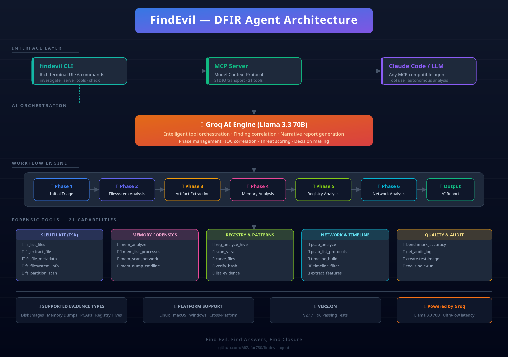

<p align="center">
  
  
  
  
</p>

<pre align="center">
╔══════════════════════════════════════════════════════════════╗
║                                                              ║
║     ______ _       _   ______        _ _                     ║
║    |  ___(_)     | | |  ____|      (_) |                    ║
║    | |_   _  __ _| | | |__   _ __   _| | ___  ___          ║
║    |  _| | |/ _` | | |  __| | '_ \ | | |/ _ \/ __|         ║
║    | |   | | (_| | | | |____| |_) || | |  __/\__ \         ║
║    \_|   |_|\__, |_| \_____/| .__/ |_|_|\___||___/         ║
║              __/ |          | |                             ║
║             |___/           |_|                             ║
║                                                              ║
║     Autonomous DFIR Analysis Agent                          ║
║     AI-Powered Digital Forensics & Incident Response        ║
║                                                              ║
╚══════════════════════════════════════════════════════════════╝
</pre>

<h3 align="center">
  🔬 Automated Evidence Analysis · 🧠 AI-Driven Investigation · 🛠️ 21 Forensic Tools
</h3>

---

## 🔥 Overview

**FindEvil** is an autonomous digital forensics and incident response (DFIR) agent that leverages **Groq AI (Llama 3.3 70B)** to intelligently orchestrate forensic investigations. Given evidence — disk images, memory dumps, PCAPs, or registry hives — it analyzes the artifacts, correlates findings, and produces a narrative report.

> "_Find Evil, find answers, find closure._"

### 🧠 How It Works

FindEvil operates in phases, each powered by a selection of its 21 forensic tools:

1. **Triage** — Initialize, verify evidence integrity via hashing, inspect filesystem metadata
2. **Filesystem Analysis** — List files, extract metadata, recover deleted content
3. **Artifact Extraction** — Carve deleted files, scan with YARA rules
4. **Memory Analysis** — List processes, scan network connections, dump command lines
5. **Registry Analysis** — Parse hive files, extract keys and values
6. **Network Analysis** — Analyze PCAPs, extract protocols, reconstruct conversations
7. **AI Report** — Groq LLM synthesizes findings into a natural-language report

---

## 🏗️ Architecture

<p align="center">
  
  <br />
  <em>Full architecture: CLI → MCP Server → Groq AI → 6-Phase Workflow → 21 Forensic Tools</em>
</p>

> 📥 **Download:** [SVG Diagram](docs/architecture.svg) · [PNG Diagram](docs/findevil-architecture.png)

Or view the architecture in your terminal:

```bash
findevil ascii-arch
```

```
  ┌─────────────────┐    ┌─────────────────┐    ┌─────────────────┐
  │   💻 findevil    │    │   🔌 MCP Server  │    │   🤖 Claude/LLM │
  │   Rich CLI App   │───▶│   21 Tools API   │───▶│   MCP Client    │
  └─────────────────┘    └─────────────────┘    └─────────────────┘
                            │
                            ▼
              ┌───────────────────────────────┐
              │   🧠 Groq AI (Llama 3.3 70B)  │
              └───────────────────────────────┘
                            │
                            ▼
  ┌───────┐ ┌───────┐ ┌───────┐ ┌───────┐ ┌───────┐ ┌───────┐
  │Triage │→│  FS   │→│Carving│→│Memory │→│Registry│→│Network│
  └───────┘ └───────┘ └───────┘ └───────┘ └───────┘ └───────┘
```

---

## ✨ Features

| Category | Capability |
|----------|------------|
| 🤖 **AI-Powered** | Groq Llama 3.3 70B orchestrates tools and writes analysis reports |
| 🛠️ **21 Tools** | TSK (fls, icat, mmls, fsstat, istat), foremost, YARA, tshark, Volatility 3, regipy, and more |
| 💾 **Memory Forensics** | Process listing, network scanning, command-line extraction via Volatility 3 |
| 🗂️ **Filesystem Forensics** | Full TSK integration: NTFS, ext2/3/4, FAT, HFS+ |
| 📡 **Network Forensics** | PCAP analysis with tshark, protocol dissection, conversation reconstruction |
| 🪟 **Windows Registry** | Hive parsing via regipy — SAM, SYSTEM, SOFTWARE, NTUSER.DAT |
| 🧩 **File Carving** | Foremost YARA integration for pattern-based carving |
| 🔌 **MCP Server** | Model Context Protocol server for Claude Code and other LLM integration |
| 🖥️ **Rich CLI** | Beautiful ASCII logo, colored output, progress bars (via `rich`) |
| 🌍 **Cross-Platform** | Linux, macOS, Windows — with automatic path resolution |

---

## 🚀 Quick Start

### Prerequisites

- **Python 3.10+**
- **System Tools** (recommended): `sudo apt install sleuthkit foremost yara tshark` (Linux) or `brew install` (macOS)
- **Groq API Key**: [Get one free](https://console.groq.com)

### Install

```bash
# Clone and enter
git clone <your-repo-url>
cd findevil-memorygraph

# Create virtual environment
python3 -m venv venv
source venv/bin/activate  # On Windows: venv\Scripts\activate

# Install
pip install -e .
```

### Check Environment

Verify everything is in place:

```bash
findevil check
```

<pre>
╔══════════════════════════════════════════════════╗
║  FindEvil — Environment Check                   ║
╚══════════════════════════════════════════════════╝
┌────── System Tools ──────┐
│ fls       ✅ found       │
│ icat      ✅ found       │
│ mmls      ✅ found       │
│ foremost  ✅ found       │
│ yara      ✅ found       │
│ tshark    ✅ found       │
└──────────────────────────┘
┌────── Python Modules ──────┐
│ fastmcp    ✅ installed    │
│ groq       ✅ installed    │
│ volatility3 ✅ installed   │
│ regipy     ✅ installed    │
└────────────────────────────┘
✅ All systems ready for DFIR analysis!
</pre>

### Run an Investigation

```bash
export GROQ_API_KEY="gsk_..."

findevil investigate ./evidence.dd --output ./results
```

Or without AI (tool results only):

```bash
findevil investigate ./evidence.dd --no-ai
```

Run a single phase:

```bash
findevil investigate ./evidence.dd --phase memory
```

### Start MCP Server (for Claude Code)

```bash
findevil serve
```

### List Tools

```bash
findevil tools
```

### Run a Single Tool

```bash
findevil tool fs_list_files --image evidence.dd
findevil tool mem_list_processes --image memdump.raw
findevil tool scan_yara --image evidence.dd --rules "rule Bad { strings: \$a = \"evil\" condition: \$a }"
findevil tool carve_files --image evidence.dd --output ./carved
```

### Create Test Image

Generate a synthetic disk image with known artifacts for testing:

```bash
findevil create-test-image test.dd --size 50
```

---

## 🗺️ Architecture

```
┌─────────────────────────────────────────────────────────────┐
│                      FindEvil Agent                         │
├─────────────────────────────────────────────────────────────┤
│  ┌─────────────┐  ┌──────────────┐  ┌──────────────────┐   │
│  │  CLI (rich)  │  │  MCP Server  │  │  Groq AI Client  │   │
│  └──────┬───────┘  └──────┬───────┘  └────────┬─────────┘   │
│         │                 │                    │              │
│  ┌──────┴─────────────────┴────────────────────┴─────────┐   │
│  │                 DFIR Workflow Engine                   │   │
│  │  ┌──────────┐  ┌──────────┐  ┌──────────┐  ┌──────┐  │   │
│  │  │  Triage  │  │ Filesys  │  │  Memory  │  │ Net  │  │   │
│  │  └──────────┘  └──────────┘  └──────────┘  └──────┘  │   │
│  └────────────────────────────────────────────────────────┘   │
│                         │                                      │
│  ┌──────────────────────┴──────────────────────────────────┐   │
│  │               21 Forensic Tool Resolver                  │   │
│  └─────────────────────────────────────────────────────────┘   │
└─────────────────────────────────────────────────────────────┘
```

### Tool Categories

| Category | Tools |
|----------|-------|
| 🔍 **Filesystem** | `fs_list_files`, `fs_file_metadata`, `fs_extract_file`, `fs_filesystem_info` |
| 🧩 **Carving** | `carve_files` (foremost) |
| 📋 **Hashing** | `verify_hash`, `compute_hash` |
| 🧬 **YARA** | `scan_yara` |
| 🧠 **Memory** | `mem_list_processes`, `mem_analyze`, `mem_scan_network`, `mem_dump_cmdline` |
| 🪟 **Registry** | `reg_analyze_hive`, `reg_list_keys`, `reg_get_value` |
| 📡 **Network** | `pcap_analyze`, `pcap_list_protocols`, `pcap_extract_streams` |
| ℹ️ **Info** | `list_evidence`, `get_case_info`, `export_timeline` |

---

## 🧪 Test Image

Generate a synthetic disk image to test the agent:

```bash
findevil create-test-image test.dd --size 50
findevil investigate test.dd --no-ai
```

The test image includes known artifacts:
- `hello.txt` — embedded IOCs (IPs, registry keys, malware paths)
- `evil.ps1` — malicious PowerShell script
- `mimikatz_log.txt` — simulated credential dump
- Simulated SAM registry hive

---

## 🔌 MCP Server Integration

FindEvil implements the **Model Context Protocol** (MCP), making it compatible with:

### Claude Code

```bash
# In Claude Code config:
{
  "mcpServers": {
    "findevil": {
      "command": "findevil",
      "args": ["serve"],
      "env": {
        "GROQ_API_KEY": "gsk_..."
      }
    }
  }
}
```

### Custom LLM Clients

Any MCP-compatible LLM client can use FindEvil's tools. See `examples/mcp_client.py` for a reference.

---

## ⚙️ Configuration

### Environment Variables

| Variable | Default | Description |
|----------|---------|-------------|
| `GROQ_API_KEY` | — | Groq API key (required for AI features) |
| `EVIDENCE_ROOT` | `/evidence` | Default evidence directory |
| `RESULTS_ROOT` | `/results` | Default results directory |

### CLI Options

```bash
findevil investigate <evidence> [options]

Options:
  --output PATH      Output directory for results
  --task TEXT        Natural language task for AI
  --groq-model TEXT  Groq model (default: llama-3.3-70b-versatile)
  --no-ai            Skip AI report generation
  --phase PHASE      Run specific phase only
  --json             Output results as JSON
  --debug            Enable debug logging
  --no-logo          Skip ASCII logo
```

---

## 📦 Project Structure

```
findevil-memorygraph/
├── src/
│   ├── cli.py              # Rich CLI entry point
│   ├── server.py           # MCP server implementation
│   ├── agent/
│   │   ├── loop.py         # DFIR workflow + MCP client
│   │   └── groq_client.py  # Groq LLM integration
│   └── tools/
│       ├── __init__.py
│       ├── tool_defs.py    # 21 tool definitions
│       └── tool_resolver.py# Cross-platform tool resolution
├── examples/
│   └── mcp_client.py       # Reference MCP client
├── pyproject.toml          # PEP 621 project config
├── README.md               # This file
└── LICENSE
```

---

## 🛠️ Development

```bash
# Install in editable mode
pip install -e .

# Install dev dependencies
pip install pytest pytest-asyncio rich pyfiglet

# Generate architecture assets
pip install cairosvg          # SVG → PNG rendering
python docs/generate-png.py   # Generate architecture.png

# Run tests
pytest tests/

# Lint
ruff check src/
```

---

## 🤝 Contributing

1. Fork the repository
2. Create a feature branch: `git checkout -b feat/amazing-feature`
3. Commit changes: `git commit -m "feat: add amazing feature"`
4. Push: `git push origin feat/amazing-feature`
5. Open a Pull Request

---

## 📄 License

MIT License — see [LICENSE](LICENSE)

---

<p align="center">
  <b>FindEvil</b> — Autonomous DFIR Analysis Agent<br>
  <sub>Powered by Groq AI · Sleuthkit · YARA · Volatility · TShark</sub>
</p>
